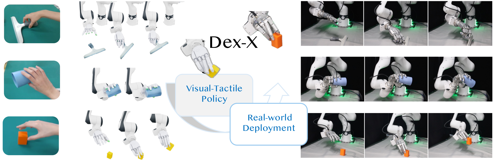
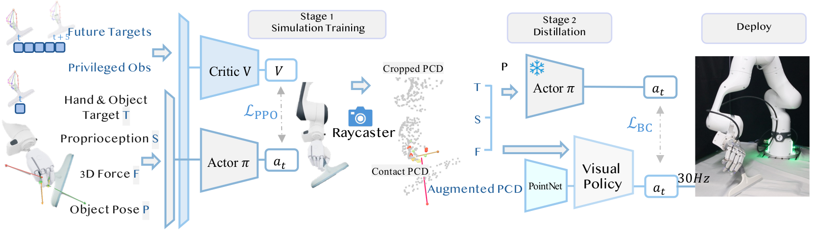
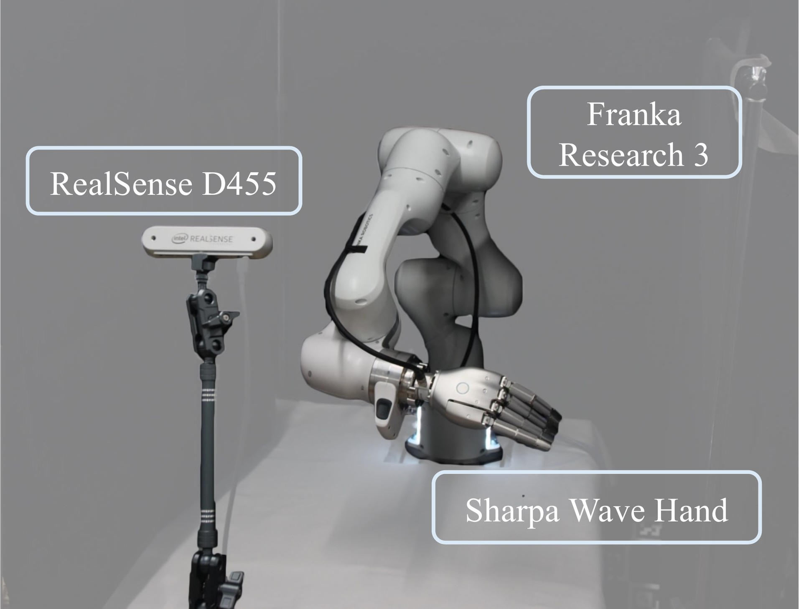

<h1 align="center">Dex-X: Learning Visual-Tactile Dexterous Manipulation From Human Videos with Simulated Interaction</h1>

<p align="center">Learn deployable visual-tactile dexterous manipulation policies from human video demonstrations: replay the demonstrations in simulation to recover the missing contact signal, train a tactile-aware teacher, and distill it into a point-cloud + tactile policy that transfers zero-shot to a real hand-arm platform.</p>

<p align="center">
<a href="https://dexx-code.github.io/dexx-code/"></a>
<a href="https://arxiv.org/abs/2609.07747"></a>
<a href="https://dexx-code.github.io/dexx-code/"></a>
<a href="LICENSE"></a>
<a href="tutorial/00_setup/"></a>
<a href="tutorial/00_setup/"></a>
<a href="tutorial/00_setup/"></a>
</p>

<p align="center">

</p>

---

## Overview

Human videos show what dexterous manipulation looks like, but not what it feels like. Dex-X uses simulation as a tactile completion engine: monocular human demonstrations (MANO hand + object trajectories) are retargeted to a **Franka FR3 arm + Sharpa Wave hand** (7 + 22 DOF) and replayed in **Isaac Lab**, where physically grounded contact provides the tactile supervision the videos lack. A privileged PPO teacher learns to track the demonstrations with tactile feedback, and is distilled with DAgger into a deployable policy that reads only a point cloud, proprioception and tactile sensing.

> **This is the tutorial version of the Dex-X code.** It walks through the full pipeline, and we provide four sample demonstrations to run it on.

<p align="center">

</p>

*Dex-X pipeline. Stage 1: a PPO teacher is trained in simulation with privileged observations (future targets, hand & object targets, proprioception, 3D contact force, object pose). Stage 2: the teacher is distilled into a visual-tactile student (PointNet over the cropped scene, hand and contact point clouds) with behaviour cloning on DAgger rollouts. Deploy: the student runs at 30 Hz on the real robot.*

**Highlights**

- **Human video → robot trajectory**: MANO-to-Sharpa retargeting with arm IK, reachability checks and a viser viewer for the retargeted hand, object and table.
- **Tactile-aware teacher**: PPO in Isaac Lab with privileged state and simulated fingertip contact force.
- **Deployable visual-tactile student**: DAgger distillation onto a 417-d proprioception vector plus scene / hand / tactile point clouds — no object pose at deploy.
- **Sim-to-real toolchain**: camera calibration (easy_handeye → multi-pose ICP → table levelling), dynamics system-ID, and a real-robot runtime over Polymetis (reference) or ROS2 (experimental).
- **Tutorial + agent skills**: ten lessons in rebuild order, each with a runnable check, and Claude Code skills for setup, deployment, sim2real testing, calibration and porting to new hands or data.

## Installation

The pinned baseline is **Isaac Sim 4.5 + Isaac Lab v2.2.1 + Python 3.10** (torch 2.7 / cu128). Prepare the Isaac Lab checkout and system packages as described in [MANUAL_SETUP.md](tutorial/00_setup/MANUAL_SETUP.md), then:

```Bash
git clone https://github.com/gcfy63821/dex_learning_kit.git
cd dex_learning_kit

# uv (Isaac Sim from pip wheels; needs glibc >= 2.34)
bash tutorial/00_setup/setup_uv.sh --isaaclab /path/to/IsaacLab --venv .venv --accept-eula
#   older glibc (e.g. Ubuntu 20.04): add --isaacsim /path/to/isaac-sim
source .venv/bin/activate

# or conda + a binary Isaac Sim
bash tutorial/00_setup/setup_env.sh --isaacsim /path/to/isaac-sim --isaaclab /path/to/IsaacLab
```

Check the install, cheapest first:

```Bash
python tutorial/00_setup/check_install.py            # files, assets, demos, calibrations, checkpoints
python tutorial/00_setup/check_imports.py            # every import the code makes
bash tutorial/run_acceptance.sh                      # short train + eval, end to end
```

## Repository Structure

```bash
src/dexx/                         # the dexx package
├── tasks/franka_sharpa/          # Isaac Lab envs: base → force → critic_horizon → poseobs → pointcloud, deploy envs
├── tasks/hand_imitation/         # demo loaders, hand models, arm clients (Polymetis / ROS2)
├── algo/                         # PPO, DAgger point-cloud distillation, networks
├── deploy_config.py              # sim2real geometry: table, arm base, crop box, intrinsics, ports
└── robot_constants.py            # arm / hand gains, armature, friction
scripts/                          # retarget / train / eval / play / record entry points, asset builders
deploy/                           # real-robot runtime: deploy_pc.py, Polymetis bridge, depth publisher, ros2/
tools/
├── dataset/                      # demo preview, rotation, drop test, manual fixes, view_retarget.py
├── calib/                        # camera calibration (easy_handeye conversion, ICP, table levelling, overlays)
└── sysid/                        # sim-vs-real motion replay for gain alignment
assets/                           # FR3 + Sharpa Wave models, merged URDF, robot USDs
data/                             # four sample demonstrations + their retargeted trajectories
checkpoints/                      # shipped teacher and student (see checkpoints/README.md)
calib/camera_align/               # camera extrinsics (pass one with --camera_extrinsic)
tutorial/                         # ten lessons, 00_setup … 09_deploy
.claude/skills/                   # Claude Code skills
```

## Training and Evaluation

All commands run from the repository root; add `--headless` on a machine without a display.

### Retargeting (human demo → robot trajectory):

```Bash
python -u scripts/retarget.py --side right --data_idx rt/0416_grasp/cube_small_2 \
    --dump_root logs/retarget --headless
python tools/dataset/view_retarget.py --data_idx rt/0416_grasp/cube_small_2@0 \
    --retarget_root logs/retarget                    # viser: robot + object + targets
```
+ `--data_idx`: `rt/<task>/<seq>`; the sequence's MANO joints and object trajectory are read from `data/robotool_batch/`.

+ `--dump_root` (Optional): write to a scratch directory instead of `data/retargeting/…`, which training reads.

+ `view_retarget.py --summary_only` prints the frame-0 checks (object vs table, end-effector and fingertip errors) without a browser.

### Teacher (PPO with privileged state):

```Bash
python scripts/train_teacher.py --task franka-sharpa-force-poseobs --side right \
    --data_idx '["rt/0416_grasp/cube_small_2"]' --num_envs 2048 --headless
```
+ `--data_idx`: one or more retargeted demos.

+ `--no-wandb` (Optional): train without Weights & Biases.

+ A pretrained teacher ships as `checkpoints/teacher_poseobs.pth`.

### Student (DAgger point-cloud distillation):

```Bash
python scripts/train_dagger_pc.py --task franka-sharpa-pointcloud \
    --teacher_ckpt checkpoints/teacher_poseobs.pth --side right \
    --data_idx '["rt/0416_grasp/cube_small_1","rt/0416_grasp/cube_small_2","rt/0420_manip/squeegee_1","rt/0420_manip/squeegee_2"]' \
    --num_envs 128 --dagger_iters 30 --rollout_steps 4096 --beta_init 1.0 --beta_decay 0.85 \
    --train_epochs 8 --batch_size 512 --lr 5e-5 --max_buffer 200000 --hand_body_subset minimal6 \
    --student_drop_slots obj_bps,tips_distance,obj_pose_tail \
    --camera_extrinsic calib/camera_align/current.npy --seed 42 --out_dir logs/dagger_pc --headless
```
+ `--student_drop_slots`: removes the observations that do not exist on the robot (object shape code, demo fingertip distances, object pose); this is what makes the student deployable.

+ `--camera_extrinsic`: the camera pose the scene point cloud is rendered from; deploy with the same file.

### Evaluation:

```Bash
python scripts/eval.py --task franka-sharpa-pointcloud \
    --load_path checkpoints/student_lean_v6_L1.pth --side right \
    --data_idx '["rt/0416_grasp/cube_small_2"]' \
    --camera_extrinsic calib/camera_align/current.npy \
    --max_episodes 400 --out_dir logs/eval_quickstart --headless
```
+ `--max_episodes` (Optional): a quick check; without it `eval.py` runs the full reference protocol (8000 episodes, augmentation variants expanded, physics randomisation on).

+ `--no-expand_aug` / `--per_demo_quota -1` / `--no-keep_physics_dr` (Optional): base demos only / a balanced number of episodes per demo / nominal physics.

+ Report **strict3** (object ends within 3 cm of the demo's final pose, no drift), per demo — see [EVAL.md](docs/EVAL.md). Install-check numbers for the shipped checkpoints are in [checkpoints/README.md](checkpoints/README.md).

## Real-Robot Deployment

<p align="center">

</p>

Three machines: a NUC running Polymetis and `deploy/polymetis_joint_bridge.py` (arm), a camera host running `deploy/realsense_depth_zmq_pub.py` (RealSense D455 depth), and the inference PC running the student with the Sharpa hand over USB:

```Bash
python deploy/deploy_pc.py \
    --load_path checkpoints/student_lean_v6_L1.pth --side right \
    --data_idx '["rt/0416_grasp/cube_small_2"]' \
    --camera_extrinsic calib/camera_align/current.npy \
    --pc_workspace_min 0.0,-0.40,0.422 \
    --polymetis_ip <NUC_IP> --depth_zmq_addr tcp://<CAM_HOST>:5562 --headless
```

Launch order, Polymetis parameters, e-stops, the experimental ROS2 backend (`--arm_backend ros2 --depth_backend ros2`) and the first-run checklist are in [DEPLOY.md](docs/DEPLOY.md); camera calibration is [tutorial/06](tutorial/06_camera_calibration/) and dynamics alignment [tutorial/07](tutorial/07_dynamics_alignment/).

## Data Structure

Sample demonstrations live in `data/robotool_batch/` and their retargeted trajectories in `data/retargeting/`. A sequence is addressed as `rt/<task>/<seq>`; augmentation variants of a retarget as `rt/<task>/<seq>@<aug>`.

```bash
data/
|-- robotool_batch/
|   |-- models/<object_id>/            # object mesh (cleaned_mesh_10000.obj), URDF, tool.usd
|   |-- <task>/<seq>/
|       |-- meta.json                  # task, sequence, object ids, hand side, frame count
|       |-- mano_joints.pkl            # MANO joint positions + object poses (camera frame)
|       |-- mano_joints_corrected.pkl  # + z_bottom_offset from tools/dataset/drop_test.py
|-- retargeting/robotool_batch/mano2sharpa_rh/
    |-- <task>/<seq>@0.pkl             # retargeted arm + hand joints, wrist and keypoint targets
```

Previewing, rotating, drop-testing and fixing demonstrations: [tools/dataset/README.md](tools/dataset/README.md).

## Documentation

**Start:** [tutorial/](tutorial/) — ten lessons in rebuild order, each with a check you can run.

**Reference:**
- [docs/RETARGET.md](docs/RETARGET.md) — MANO → Sharpa retargeting
- [docs/TRAINING.md](docs/TRAINING.md) — PPO teacher
- [docs/DISTILLATION.md](docs/DISTILLATION.md) — DAgger point-cloud student
- [docs/EVAL.md](docs/EVAL.md) — evaluation protocol and metrics
- [docs/DEPLOY.md](docs/DEPLOY.md) — real-robot launch and safety
- [docs/JOINT_ORDERING.md](docs/JOINT_ORDERING.md) — hand joint orders (read before any sim2real work)
- [docs/DEBUG_TOOLS.md](docs/DEBUG_TOOLS.md) — index of the calibration, sysid and deploy tools
- [tutorial/CODE_MAP.md](tutorial/CODE_MAP.md) — where things live in the code
- [assets/ASSETS.md](assets/ASSETS.md), [checkpoints/README.md](checkpoints/README.md), [calib/camera_align/README.md](calib/camera_align/README.md) — assets, checkpoints, extrinsics

**Claude Code skills** ([.claude/skills/](.claude/skills/)), picked up automatically when Claude Code runs from the repository root: `dexx-codebase-guide`, `dexx-real-robot-deploy`, `dexx-sim2real-testing`, `dexx-camera-calibration`, `dexx-new-hand-and-data`.

## Citation

If you find Dex-X useful in your research, please consider citing:

```bibtex
@misc{chen2026dexxlearningvisualtactiledexterous,
      title={Dex-X: Learning Visual-Tactile Dexterous Manipulation From Human Videos with Simulated Interaction},
      author={Ruoqu Chen and Feixiang Ruan and Liu Cao and Zihao Wang and Botian Xu and Shiqin Tong and Jiajun Liu and Mingzhi Pei and Chenyu Zhang and Wanli Xing and Kaifeng Zhang and Mengdi Xu},
      year={2026},
      eprint={2609.07747},
      archivePrefix={arXiv},
      primaryClass={cs.RO},
      url={https://arxiv.org/abs/2609.07747},
}
```

## License

The project's own code is released under the [MIT License](LICENSE); vendored code and data are listed in [THIRD_PARTY_NOTICES.md](THIRD_PARTY_NOTICES.md). `assets/franka_fr3/` (Franka FR3 description) and `assets/sharpa_wave/` (from [sharpa-robotics/sharpa-urdf-usd-xml](https://github.com/sharpa-robotics/sharpa-urdf-usd-xml)) are third-party content redistributed under the **Apache License 2.0**; their `LICENSE` / `LICENSE.txt` / `NOTICE.txt` are retained in those directories and must not be removed. See [assets/ASSETS.md](assets/ASSETS.md) for the provenance of every asset.
